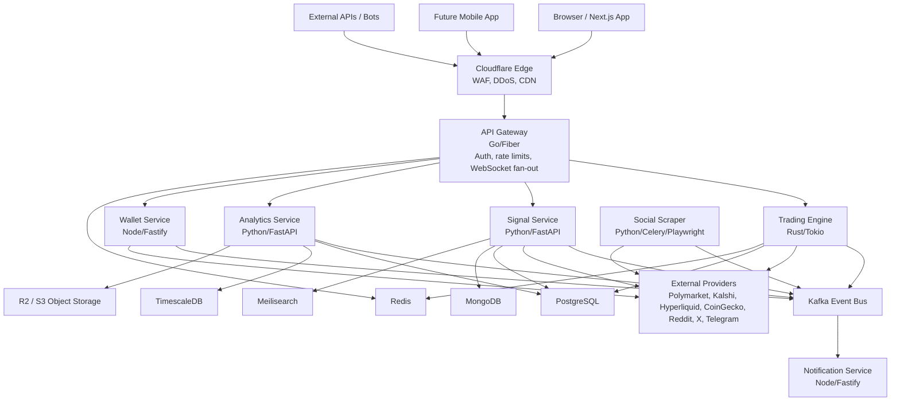
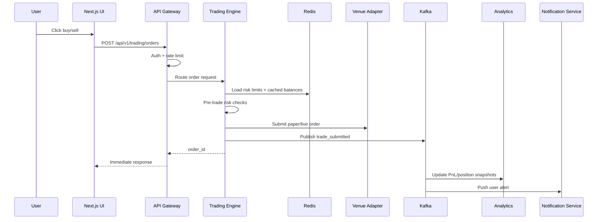
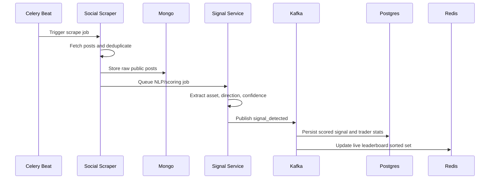
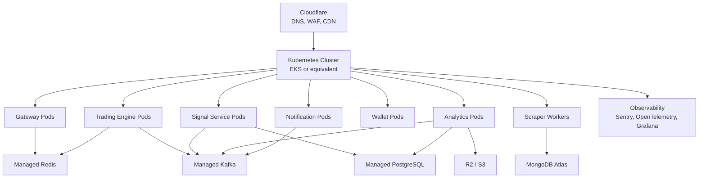

# BITprivat V1 Technical Architecture

Version 1.0 - April 2026 - Confidential

## Executive Summary

BITprivat is the target evolution of Bot Society Markets into an agentic market-intelligence and trading platform. The platform combines live market data, prediction-market intelligence, social signal scoring, strategy simulation, paper trading, and eventually user-approved execution across prediction markets, crypto spot markets, and perpetual futures.

This document describes the target V1 architecture. It is intentionally larger than the current MVP. The current implementation remains a Python-first FastAPI application deployed through Docker/Akash, while this architecture defines the professional direction for a modular, auditable, scalable SaaS platform.

The architecture is built around three principles:

- Latency-sensitive trading paths must be separated from analytics, scraping, and dashboard rendering.
- Domains must be independently deployable: gateway, signal intelligence, trading, analytics, wallet, notification, and scraping.
- Every important decision must be auditable: signals, strategy runs, order attempts, user configuration changes, provider fallbacks, and execution outcomes.

## Recommended Tech Stack

### Frontend

| Layer | Choice | Reason |
| --- | --- | --- |
| Framework | Next.js App Router | SEO-friendly public pages, strong dashboard routing, server components, and one frontend deployment target. |
| Language | TypeScript | Shared contracts, safer refactors, and typed API client generation. |
| Styling | Tailwind CSS plus shadcn/ui primitives | Fast product iteration without losing design control. |
| Charts | TradingView Lightweight Charts | Lightweight, professional charting for live prices, backtests, and strategy views. |
| Wallet UX | Wagmi plus viem | Type-safe EVM wallet connection and contract interaction flow. |
| Data State | TanStack Query plus Zustand | Server cache and optimistic UI through TanStack Query; local trading form state through Zustand. |
| Forms | React Hook Form plus Zod | Shared validation schemas and predictable form behavior. |
| Real Time | Native WebSocket | Low-overhead streaming for prices, order status, signals, and portfolio updates. |

### Backend Services

| Service | Runtime | Purpose |
| --- | --- | --- |
| API Gateway | Go/Fiber | Auth, rate limits, routing, API keys, WebSocket fan-out, and observability. |
| Trading Engine | Rust/Tokio | Low-latency order routing, paper execution, venue adapters, and risk checks. |
| Signal Service | Python/FastAPI | Signal scoring, NLP, trader rankings, social signal interpretation, and leaderboard APIs. |
| Analytics Service | Python/FastAPI | PnL, historical charts, backtests, strategy reports, and portfolio snapshots. |
| Social Scraper | Python/Celery/Playwright | X/Twitter, Reddit, Telegram, and web ingestion jobs. |
| Wallet Service | Node/Fastify/ethers | Wallet connections, balances, KYC orchestration, unsigned transaction construction, and chain reads. |
| Notification Service | Node/Fastify | Email, Telegram, browser push, in-app alerts, and event-driven notifications. |

### Data Layer

| Store | Technology | Use |
| --- | --- | --- |
| Primary database | PostgreSQL 16 | Users, wallets, follows, orders, positions, strategies, audit log, billing state. |
| Time-series | TimescaleDB | OHLCV data, portfolio snapshots, PnL curves, signal accuracy history. |
| Cache and pub/sub | Redis 7 | Sessions, rate limits, live leaderboard sorted sets, price cache, circuit breakers. |
| Document store | MongoDB | Raw social posts, scraped profiles, unstructured source metadata. |
| Search | Meilisearch | Trader, signal, market, and asset search. |
| Object storage | Cloudflare R2 or S3 | Backtest result blobs, exported reports, screenshots, and generated packages. |
| Event bus | Kafka | Durable trade, signal, price, portfolio, and audit event streams. |

## System Architecture Overview



## Critical Request Flows

### Trade Execution Path



### Social Signal Ingestion



## Service Breakdown

### API Gateway

The API Gateway owns edge concerns and must not own product business logic.

Responsibilities:

- JWT and API key validation.
- Refresh-token cookie handling through an auth service or auth module.
- Tier-aware rate limiting through Redis.
- WebSocket fan-out for prices, orders, portfolio updates, and signal events.
- Request routing to internal services through HTTP/2 or gRPC.
- OpenTelemetry instrumentation.
- Request/response logging with PII redaction.

### Trading Engine

The Trading Engine is the only service allowed to submit live or paper orders.

Responsibilities:

- Unified order model across Polymarket, perpetual venues, spot venues, and paper mode.
- Pre-trade risk checks: notional limit, daily loss limit, max position size, venue allowlist, slippage protection.
- Paper execution on the same logical route as live execution, with a paper adapter replacing the venue submit step.
- Order reconciliation through venue polling and WebSocket updates.
- Kafka events for order submitted, order rejected, order filled, and order cancelled.

Target adapters:

- Polymarket CLOB adapter.
- Kalshi adapter after commercial/legal review.
- Hyperliquid adapter.
- CCXT spot adapter for exchanges such as Binance, Coinbase Advanced, Kraken, and OKX.
- Paper adapter for internal simulation.

### Signal Service

The Signal Service scores source credibility and converts public signals into structured market intelligence.

Responsibilities:

- Maintain ranked social trader profiles.
- Classify posts into asset, direction, confidence, source, and time horizon.
- Score historical accuracy, PnL attribution, Sharpe-like consistency, and recency-weighted hit rate.
- Serve leaderboard and signal feed APIs.
- Publish signal events to Kafka.
- Support user follow and auto-trade rule activation in coordination with the Trading Engine.

Simplified score model:

```text
TraderScore = sum(signal_weight * outcome_pnl) / total_signals

signal_weight = recency_decay(signal_age_days) * confidence_score * source_trust
recency_decay(age_days) = exp(-0.02 * age_days)
```

### Social Scraper

The Social Scraper is async and never sits in the trading critical path.

Responsibilities:

- Monitor configured handles, subreddits, channels, RSS feeds, and web sources.
- Use official APIs when available.
- Use Playwright only where terms and operational policy allow.
- Deduplicate public posts through content hashes.
- Store raw data in MongoDB, then dispatch NLP work.
- Track rate-limit budgets in Redis.

Compliance rule:

- Only collect data that the platform is permitted to collect under each source's terms and user authorization state.

### Analytics Service

Responsibilities:

- PnL computation from fills, positions, and price history.
- Backtest execution and result packaging.
- Timescale continuous aggregates for charting windows.
- Daily and intraday portfolio snapshots.
- Strategy Lab report generation.
- Signal outcome resolution and accuracy history.

### Wallet Service

Responsibilities:

- Non-custodial wallet connection.
- Balance and position cache.
- Unsigned transaction construction.
- WalletConnect session orchestration.
- KYC workflow integration through a compliant third-party provider.
- No private-key custody, no signing, and no withdrawal logic.

### Notification Service

Responsibilities:

- Consume Kafka events.
- Send in-app, email, Telegram, and browser push notifications.
- Apply user notification preferences.
- Retry delivery with bounded backoff.
- Track notification health and failures.

## Core Data Models

### users

```sql
CREATE TABLE users (
  id UUID PRIMARY KEY DEFAULT gen_random_uuid(),
  email TEXT UNIQUE NOT NULL,
  username TEXT UNIQUE,
  password_hash TEXT,
  kyc_status TEXT DEFAULT 'none',
  kyc_provider_id TEXT,
  tier TEXT DEFAULT 'free',
  created_at TIMESTAMPTZ DEFAULT now(),
  updated_at TIMESTAMPTZ DEFAULT now()
);
```

### wallets

```sql
CREATE TABLE wallets (
  id UUID PRIMARY KEY DEFAULT gen_random_uuid(),
  user_id UUID NOT NULL REFERENCES users(id) ON DELETE CASCADE,
  address TEXT NOT NULL,
  chain_id INTEGER NOT NULL,
  label TEXT,
  wallet_type TEXT NOT NULL,
  is_primary BOOLEAN DEFAULT false,
  connected_at TIMESTAMPTZ DEFAULT now(),
  UNIQUE(user_id, address, chain_id)
);
```

### traders

```sql
CREATE TABLE traders (
  id UUID PRIMARY KEY DEFAULT gen_random_uuid(),
  handle TEXT NOT NULL,
  platform TEXT NOT NULL,
  platform_user_id TEXT,
  display_name TEXT,
  avatar_url TEXT,
  bio TEXT,
  follower_count INTEGER,
  signal_count INTEGER DEFAULT 0,
  win_rate NUMERIC(5,4),
  avg_pnl_pct NUMERIC(10,4),
  score NUMERIC(10,4),
  score_updated_at TIMESTAMPTZ,
  tracked_since TIMESTAMPTZ DEFAULT now(),
  is_active BOOLEAN DEFAULT true,
  UNIQUE(platform, platform_user_id)
);

CREATE INDEX idx_traders_score ON traders(score DESC);
CREATE INDEX idx_traders_platform ON traders(platform, is_active);
```

### signals

```sql
CREATE TABLE signals (
  id UUID PRIMARY KEY DEFAULT gen_random_uuid(),
  trader_id UUID REFERENCES traders(id),
  source_post_id TEXT,
  asset_symbol TEXT NOT NULL,
  asset_type TEXT NOT NULL,
  direction TEXT NOT NULL,
  confidence NUMERIC(4,3),
  raw_text TEXT,
  mentioned_price NUMERIC,
  target_price NUMERIC,
  signal_at TIMESTAMPTZ NOT NULL,
  resolved_at TIMESTAMPTZ,
  outcome TEXT,
  outcome_pnl_pct NUMERIC(10,4),
  created_at TIMESTAMPTZ DEFAULT now()
);

CREATE INDEX idx_signals_trader ON signals(trader_id, signal_at DESC);
CREATE INDEX idx_signals_asset ON signals(asset_symbol, signal_at DESC);
```

### follows

```sql
CREATE TABLE follows (
  id UUID PRIMARY KEY DEFAULT gen_random_uuid(),
  user_id UUID NOT NULL REFERENCES users(id) ON DELETE CASCADE,
  trader_id UUID NOT NULL REFERENCES traders(id),
  auto_trade BOOLEAN DEFAULT false,
  auto_trade_rules JSONB,
  followed_at TIMESTAMPTZ DEFAULT now(),
  UNIQUE(user_id, trader_id)
);
```

### orders

```sql
CREATE TABLE orders (
  id UUID PRIMARY KEY DEFAULT gen_random_uuid(),
  user_id UUID NOT NULL REFERENCES users(id),
  wallet_id UUID REFERENCES wallets(id),
  signal_id UUID REFERENCES signals(id),
  is_paper BOOLEAN DEFAULT false,
  venue TEXT NOT NULL,
  asset_symbol TEXT NOT NULL,
  order_type TEXT NOT NULL,
  side TEXT NOT NULL,
  quantity NUMERIC NOT NULL,
  price NUMERIC,
  status TEXT DEFAULT 'pending',
  filled_quantity NUMERIC DEFAULT 0,
  avg_fill_price NUMERIC,
  fee NUMERIC,
  fee_currency TEXT,
  exchange_order_id TEXT,
  submitted_at TIMESTAMPTZ DEFAULT now(),
  filled_at TIMESTAMPTZ,
  cancelled_at TIMESTAMPTZ,
  metadata JSONB
);

CREATE INDEX idx_orders_user ON orders(user_id, submitted_at DESC);
CREATE INDEX idx_orders_status ON orders(status) WHERE status IN ('pending', 'open');
```

### positions

```sql
CREATE TABLE positions (
  id UUID PRIMARY KEY DEFAULT gen_random_uuid(),
  user_id UUID NOT NULL REFERENCES users(id),
  wallet_id UUID REFERENCES wallets(id),
  venue TEXT NOT NULL,
  asset_symbol TEXT NOT NULL,
  is_paper BOOLEAN DEFAULT false,
  side TEXT NOT NULL,
  quantity NUMERIC NOT NULL,
  entry_price NUMERIC NOT NULL,
  current_price NUMERIC,
  unrealised_pnl NUMERIC,
  realised_pnl NUMERIC DEFAULT 0,
  leverage NUMERIC DEFAULT 1,
  liquidation_price NUMERIC,
  opened_at TIMESTAMPTZ DEFAULT now(),
  closed_at TIMESTAMPTZ,
  is_open BOOLEAN DEFAULT true
);

CREATE UNIQUE INDEX uq_open_position
ON positions(user_id, venue, asset_symbol, side, is_paper)
WHERE is_open = true;
```

### portfolio_snapshots

```sql
CREATE TABLE portfolio_snapshots (
  snapshot_at TIMESTAMPTZ NOT NULL,
  user_id UUID NOT NULL,
  total_value_usd NUMERIC NOT NULL,
  realised_pnl NUMERIC NOT NULL,
  unrealised_pnl NUMERIC NOT NULL,
  positions_json JSONB
);

SELECT create_hypertable('portfolio_snapshots', 'snapshot_at');
CREATE INDEX idx_snapshots_user ON portfolio_snapshots(user_id, snapshot_at DESC);
```

### strategies and backtest_runs

```sql
CREATE TABLE strategies (
  id UUID PRIMARY KEY DEFAULT gen_random_uuid(),
  user_id UUID NOT NULL REFERENCES users(id),
  name TEXT NOT NULL,
  description TEXT,
  config JSONB NOT NULL,
  is_active BOOLEAN DEFAULT false,
  created_at TIMESTAMPTZ DEFAULT now(),
  updated_at TIMESTAMPTZ DEFAULT now()
);

CREATE TABLE backtest_runs (
  id UUID PRIMARY KEY DEFAULT gen_random_uuid(),
  strategy_id UUID NOT NULL REFERENCES strategies(id),
  user_id UUID NOT NULL REFERENCES users(id),
  start_date DATE NOT NULL,
  end_date DATE NOT NULL,
  assets TEXT[] NOT NULL,
  status TEXT DEFAULT 'queued',
  result_object_key TEXT,
  summary JSONB,
  started_at TIMESTAMPTZ,
  completed_at TIMESTAMPTZ
);
```

### audit_log

```sql
CREATE TABLE audit_log (
  id UUID PRIMARY KEY DEFAULT gen_random_uuid(),
  actor_user_id UUID REFERENCES users(id),
  action TEXT NOT NULL,
  resource_type TEXT NOT NULL,
  resource_id TEXT,
  ip_address INET,
  user_agent TEXT,
  before_state JSONB,
  after_state JSONB,
  created_at TIMESTAMPTZ DEFAULT now()
);

CREATE INDEX idx_audit_log_actor ON audit_log(actor_user_id, created_at DESC);
CREATE INDEX idx_audit_log_resource ON audit_log(resource_type, resource_id, created_at DESC);
```

## API Structure

Target API routes are versioned under `/api/v1`. Existing MVP routes are preserved during migration and mapped through the gateway.

### Authentication

```text
POST   /api/v1/auth/register
POST   /api/v1/auth/login
POST   /api/v1/auth/refresh
POST   /api/v1/auth/logout
POST   /api/v1/auth/oauth/google
POST   /api/v1/auth/oauth/twitter
```

### Public and Landing

```text
GET    /api/v1/landing/stats
GET    /api/v1/assets
GET    /api/v1/leaderboard
GET    /api/v1/system/pulse
GET    /api/v1/system/providers
```

### Dashboard

```text
GET    /api/v1/dashboard/summary
GET    /api/v1/dashboard/positions
GET    /api/v1/dashboard/orders
GET    /api/v1/dashboard/pnl
GET    /api/v1/dashboard/activity
```

### Signals

```text
GET    /api/v1/signals
GET    /api/v1/signals/:id
GET    /api/v1/signals/traders
GET    /api/v1/signals/traders/:id
POST   /api/v1/signals/traders/:id/follow
DELETE /api/v1/signals/traders/:id/follow
PUT    /api/v1/signals/traders/:id/auto-trade
```

### Trading

```text
POST   /api/v1/trading/orders
GET    /api/v1/trading/orders/:id
DELETE /api/v1/trading/orders/:id
GET    /api/v1/trading/venues
GET    /api/v1/trading/orderbook/:asset
```

### Paper Trading

```text
POST   /api/v1/paper-trading/orders
GET    /api/v1/paper-trading/positions
GET    /api/v1/paper-trading/pnl
POST   /api/v1/paper-trading/reset
```

### Wallets

```text
GET    /api/v1/wallets
POST   /api/v1/wallets/connect
DELETE /api/v1/wallets/:id
GET    /api/v1/wallets/:id/balances
POST   /api/v1/wallets/kyc/start
GET    /api/v1/wallets/kyc/status
```

### Strategy Lab

```text
GET    /api/v1/simulation/config
POST   /api/v1/strategies
GET    /api/v1/strategies
PUT    /api/v1/strategies/:id
DELETE /api/v1/strategies/:id
POST   /api/v1/strategies/:id/backtest
GET    /api/v1/strategies/backtests/:runId
```

### WebSocket Channels

```text
wss://api.bitprivat.com/ws

subscribe: { "channel": "prices", "params": { "assets": ["BTC", "ETH"] } }
subscribe: { "channel": "orderbook", "params": { "asset": "BTC", "venue": "binance" } }
subscribe: { "channel": "portfolio", "params": {} }
subscribe: { "channel": "signals", "params": { "traders": ["trader_id_1"] } }
subscribe: { "channel": "orders", "params": {} }
```

## Third-Party Integrations

### Markets and Execution

| Integration | Purpose | Method |
| --- | --- | --- |
| Polymarket | Prediction-market data and eventual execution | CLOB REST plus WebSocket. |
| Kalshi | Prediction-market data and potential regulated execution | Public market APIs first; execution only after legal/compliance approval. |
| Hyperliquid | Perpetual futures data and testnet paper execution | API and WebSocket. |
| dYdX v4 | Perpetual futures | SDK and chain-specific integration. |
| GMX | On-chain perpetual exposure | Contract calls through wallet service. |
| Binance, Coinbase, Kraken, OKX | Spot and futures venues | CCXT-compatible adapters where legally allowed. |
| CoinGecko | Token prices and metadata | REST with Redis caching. |
| Chainlink | Oracle fallback and settlement checks | On-chain reads. |

### Social and Intelligence Sources

| Integration | Purpose |
| --- | --- |
| X/Twitter API | Tweets, reply threads, and tracked handles where permitted. |
| Reddit API | Subreddit and user monitoring. |
| Telegram | Public channel intelligence where permitted. |
| Discord | Future bot-based channel ingestion where explicitly authorized. |
| Firecrawl/Tavily-style search | Web intelligence ingestion for public sources, where permitted. |

### Identity and Payments

| Integration | Purpose |
| --- | --- |
| Stripe Billing | SaaS subscriptions and card payments. |
| Stripe Identity, Persona, or Sumsub | Identity/KYC workflow depending on regulatory posture. |
| Coinbase Commerce or similar | Optional crypto checkout for subscription payments. |
| MoonPay/Coinbase Onramp | Optional user onramp links, not custody. |

## Deployment Architecture

### Target Production



### Environment Strategy

| Environment | Infrastructure | Purpose |
| --- | --- | --- |
| dev | Docker Compose | Local loop with mock/sandbox adapters. |
| staging | Kubernetes or Akash/managed container host | Integration tests, demo, sandbox APIs, and migration testing. |
| production | Kubernetes/managed cloud with multi-AZ services | Live SaaS traffic and controlled execution features. |

### CI/CD

Target pipeline:

```text
Developer push
  -> GitHub Actions lint/typecheck/tests
  -> Build service Docker images
  -> Push images to registry
  -> Update Helm values or deployment manifests
  -> ArgoCD/GitOps sync to staging
  -> Smoke tests
  -> Manual production promotion
```

## Security Considerations

### Authentication and Authorization

- Access tokens signed with RS256 and short TTL.
- Refresh tokens stored in HttpOnly, Secure, SameSite cookies and rotated on use.
- Programmatic API keys hashed before storage and scoped by permission.
- RBAC by tier: free, pro, institutional, admin.
- MFA required for live trading, API-key trading, or admin workflows.

### Wallet and Custody

- BITprivat must not custody user private keys.
- Wallet Service constructs unsigned transactions only.
- Users sign in their own wallet.
- No withdrawal feature should exist inside BITprivat.
- Auto-trade must be restricted to user-approved venues, limits, and rules.

### Trading Risk Controls

- Daily loss limits per user.
- Max order notional and per-symbol caps.
- Slippage protection.
- Venue allowlists.
- Global circuit breaker in Redis.
- Manual reactivation after daily-loss lockout.
- Full audit trail for rule changes and execution attempts.

### Infrastructure Security

- mTLS between services in production.
- No secrets in source code.
- Secrets through managed secret stores.
- Network policies with least privilege.
- Non-root containers and read-only root filesystems where possible.
- Image scanning in CI.
- Cloudflare WAF and rate-limit rules.

### Data Privacy

- Encrypt PII at rest.
- Do not store raw KYC documents.
- Purge or summarize raw social text after retention window.
- Support user deletion workflows where legally permitted.
- Preserve anonymized trade/audit history where required.

## Scalability and Observability

### Observability Stack

| Concern | Tooling |
| --- | --- |
| Metrics | Prometheus and Grafana. |
| Traces | OpenTelemetry to Datadog or equivalent. |
| Logs | Structured JSON logs through Fluent Bit/Fluentd. |
| Errors | Sentry. |
| Status | BetterStack or Upptime. |
| Alerts | PagerDuty or equivalent. |

### Target SLOs

| Service | Availability | P99 |
| --- | --- | --- |
| API Gateway | 99.9% | Under 100 ms excluding upstream calls. |
| Trading Engine | 99.95% | Under 500 ms excluding venue-side latency. |
| Signal Service | 99.5% | Under 200 ms for leaderboard reads. |
| Analytics | 99.5% | Under 1 second for dashboard charts. |
| Scraper | 99% | Async; measured by source freshness and job completion. |

### Disaster Recovery Targets

- RTO: 30 minutes for core dashboard and paper trading.
- RPO: less than 5 minutes for order, signal, and portfolio events.
- Kafka retention: minimum 7 days for replay.
- PostgreSQL backups: continuous point-in-time recovery.
- Redis recovery: rebuilt from Kafka and database state where possible.

## Existing Route Mapping

| Current Route | Target Route | Owner |
| --- | --- | --- |
| `/landing`, `/portfolio` | `/` | Frontend |
| `/dashboard` | `/dashboard` | Frontend plus API Gateway |
| `/simulation`, `/lab` | `/lab` | Frontend plus Analytics Service |
| `/status` | `status.bitprivat.com` | Status provider or ops service |
| `/terms`, `/privacy`, `/risk` | Static legal pages | Frontend |
| `/api/landing` | `/api/v1/landing/stats` | Gateway to Analytics |
| `/api/dashboard` | `/api/v1/dashboard/summary` | Gateway to Analytics |
| `/api/signals` | `/api/v1/signals` | Gateway to Signal Service |
| `/api/leaderboard` | `/api/v1/signals/traders` | Gateway to Signal Service |
| `/api/paper-trading` | `/api/v1/paper-trading/*` | Gateway to Trading Engine |
| `/api/simulation/config` | `/api/v1/simulation/config` | Gateway to Analytics |
| `/api/system/providers` | `/api/v1/system/providers` | Gateway to internal health |
| `/api/system/pulse` | `/api/v1/system/pulse` | Gateway to internal health |
| `/api/assets` | `/api/v1/assets` | Gateway to Analytics |
| `/api/business-model` | Static/MDX content | Frontend |

## Technology Decision Log

| Decision | Alternatives | Reason |
| --- | --- | --- |
| Rust Trading Engine | Go, Node | Strong latency and memory-safety profile for execution-critical code. |
| Kafka event bus | RabbitMQ, SQS | Durable, replayable event log for audit and analytics. |
| TimescaleDB | InfluxDB, QuestDB | Postgres-native operations, SQL joins, and backup model. |
| MongoDB for raw social data | PostgreSQL JSONB | Flexible shape for heterogeneous social sources. |
| Next.js frontend | Vite SPA, Remix | Strong SSG/SSR story and dashboard routing in one framework. |
| Non-custodial wallet model | Custody, MPC | Lower custody risk and clearer user control. |

## Current Implementation Boundary

The current repository already implements:

- FastAPI application and static UI.
- Dashboard, landing, status, legal pages, and Strategy Lab.
- PostgreSQL/SQLite persistence through SQLAlchemy.
- Demo plus live-capable CoinGecko, Polymarket, Kalshi, Hyperliquid-related provider surfaces.
- Paper trading and simulation primitives.
- Stripe billing foundations.
- Akash/Docker deployment.

The target architecture described here should be treated as a V1 scale-up plan, not a claim that every listed service exists today.

