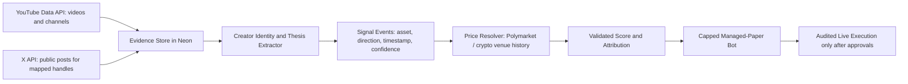

# BITprivat Creator Bots Backend Blueprint

## Product Boundary

A creator bot is an explainable market-research profile built from a trader's public content. It may produce signals and capped paper-managed allocations. It must not be described as live copy trading or validated historical performance until extracted calls are resolved against real market prices and the execution, suitability, and compliance controls are approved.

## Where The Backend Lives

| Responsibility | Production Location | Current Code Owner |
| --- | --- | --- |
| Public API, bot scorecards, follow and paper-deploy actions | FastAPI web container on Akash | `api/app/main.py`, `api/app/services.py` |
| Creator discovery and public evidence extraction | Akash worker cycle calling approved platform APIs | `api/app/social_intelligence.py`, `api/app/jobs.py`, `api/app/worker.py` |
| Creator profiles, evidence, signals, paper allocations and audit history | Neon PostgreSQL | `api/app/database.py` |
| DNS, TLS, WAF, caching and routing only | Cloudflare edge | `deploy/cloudflare/` |
| Browser experience | Static dashboard delivered by FastAPI through Cloudflare | `api/app/static/dashboard.html`, `api/app/static/app.js` |

Cloudflare should not hold provider API keys, analyze videos, make bot decisions, or own trading state. The Akash backend owns computation; Neon owns durable memory.
For public anonymous reads only, Cloudflare exposes the active Akash public read origin and may retain a short-lived copy of a successful API response or serve a visibly labelled standby snapshot if the edge-to-origin hop is temporarily unavailable. The Social Traders panel reads public creator evidence directly from Akash when available. Authenticated reads and writes remain on the audited application API path.

## Shipped Vertical Slice

1. A YouTube-first discovery provider indexes public creator/video evidence.
2. Evidence is normalized into assets, direction, confidence, and a traceable source URL.
3. Every stored creator appears as a creator-bot scorecard with decision explanations.
4. A signed-in user may follow signals or allocate a capped managed-paper budget.
5. The page now exposes source coverage, learning stage, deployment state, and backend location.
6. The dashboard hydrates its Social Traders area from the full live social API after first paint and identifies direct-live, edge-cached, or standby delivery in the UI.

Current creator returns are content-derived proxy metrics. They are not yet calculated from verified historical prices or actual fills.

## Target Real Pipeline

## Next Backend Work Packages

### 1. X Content Connector

- Add an official X API adapter in `api/app/social_intelligence.py`.
- Store creator-to-platform identity mappings, because a YouTube channel name does not prove an X account belongs to the same trader.
- Configure `BSM_X_BEARER_TOKEN`, `BSM_X_TRADER_HANDLES`, and `BSM_X_POST_LIMIT` only after the adapter and API access are approved.
- Deduplicate posts by source ID and keep source URLs for auditability.

### 2. Historical Market Validation

- Persist a timestamped extracted call before evaluating its result.
- Add a price-resolution job that reads actual historical price or market probability data after defined horizons.
- Replace proxy-return scoring with resolved outcomes, fees, slippage assumptions, and missing-data states.
- Label performance as validated only when minimum evidence and source-quality thresholds pass.

### 3. Creator-Bot Dataset And Model Governance

- Store raw-content references and extracted features separately from scores.
- Version extraction prompts/models and scoring rules.
- Preserve a decision receipt: source, extraction, market data, risk check, and paper action.
- Never generate a real creator's likeness beyond licensed or platform-supplied avatar imagery; identify the bot as a BITprivat simulation of public views.

### 4. Live Trading Gate

- Keep creator bots paper-only while proving attribution and risk controls.
- Require KYC/suitability, authorization per venue, user-set limits, circuit breakers, immutable audit logs, and legal review before any live manager mode.

## Required Environment Settings

| Setting | Purpose | Status |
| --- | --- | --- |
| `BSM_SOCIAL_DISCOVERY_PROVIDER=youtube` | Enable live YouTube discovery | Supported |
| `BSM_YOUTUBE_API_KEY` | Official YouTube Data API access | Supported |
| `BSM_X_BEARER_TOKEN` | Official X authentication | Reserved for X adapter |
| `BSM_X_TRADER_HANDLES` | Approved X creator handle watchlist | Reserved for X adapter |
| `BSM_DATABASE_URL` | Durable creator-bot memory in Neon | Supported |

## Official Provider Documentation

- YouTube Data API v3: <https://developers.google.com/youtube/v3/docs>
- X API documentation: <https://docs.x.com/x-api>
