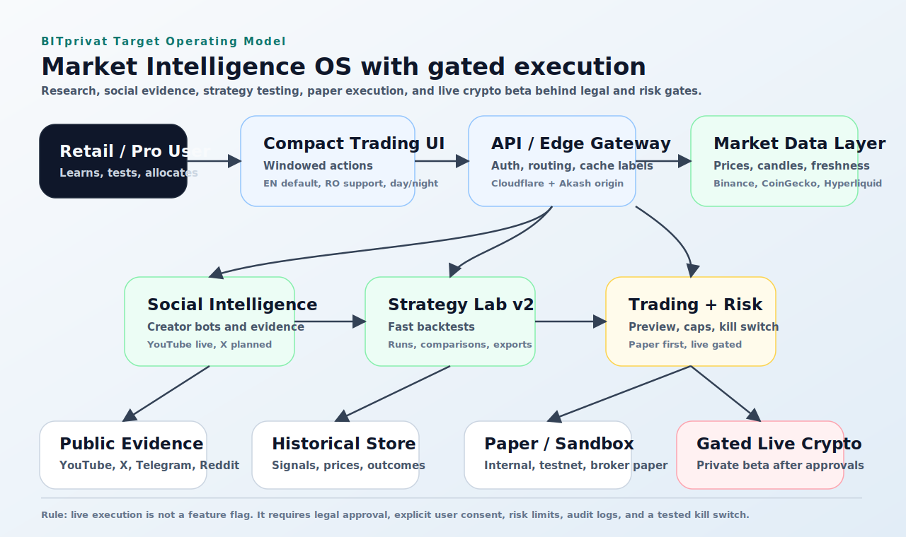
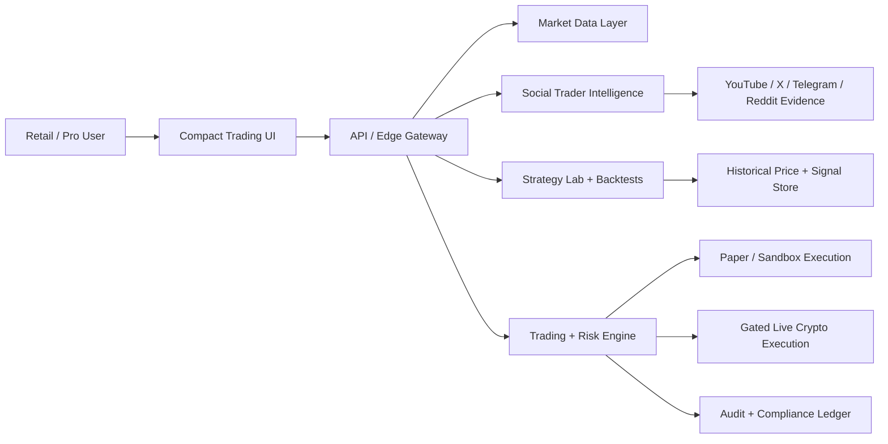
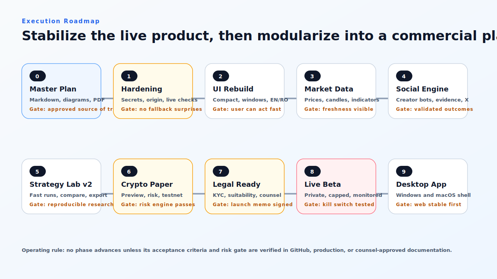
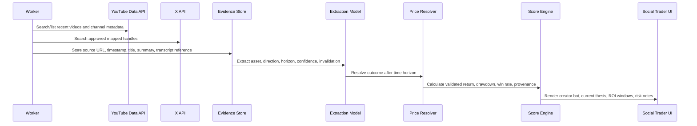
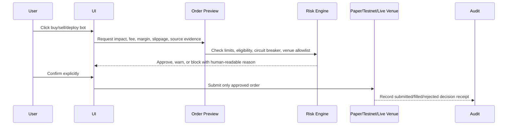

# BITprivat Master Rebuild and Commercialization Plan

Version 1.0 - May 28, 2026  
Owner: BITprivat product and engineering  
Status: Living control document  
Primary repository: https://github.com/URSUgit/bot-society-markets

## Executive Decision

BITprivat should be rebuilt as a professional Market Intelligence OS: a compact trading workstation that combines live market data, creator-trader intelligence, Strategy Lab research, paper/testnet execution, and eventually gated live crypto execution.

The rebuild must not be a blind rewrite. The current platform is live, deployed, and useful. The correct path is to stabilize the live system, harden the data and legal perimeter, then modularize the architecture around clear service boundaries.

Chosen direction:

- Rebuild approach: stabilize the live platform, then modularize.
- Commercial ambition: live trading as soon as it is professionally and legally defensible.
- First execution priority: crypto venues first.
- First launch market assumption: EU/Romania first.
- Legal boundary: research, simulation, alerts, and paper-managed bots until formal approval for live automation.
- Product truth: creator-bot ROI is currently content-derived proxy performance until resolved against real historical market prices and fills.

## Visual North Star

## Current-State Audit

Last verified during the May 28, 2026 planning session.

| Area | Status | Current Truth | Required Change |
| --- | --- | --- | --- |
| FastAPI monolith | Shipped | Production app works, but backend owns too many domains. | Keep live while extracting market, social, strategy, trading, and compliance boundaries. |
| Akash and Neon deployment | Shipped | GitHub CI, container build, and Akash CLI deploy passed on latest main commit. | Keep automated deploys, add post-deploy origin verification and rollback notes. |
| Cloudflare routing | Partial | Dashboard is live, but several public API checks reported `edge-fallback`. | Add stable origin DNS, fix worker-to-origin reliability, label all fallback data visibly. |
| Market data | Partial live | Provider status reports live-capable Binance/CoinGecko/Hyperliquid posture. | Make prices feel live in UI, add freshness timestamps, candle history, and indicator-safe APIs. |
| Social traders | Partial live | YouTube Data API is configured and 16 creator profiles were available from the live origin. | Add price-resolved outcome validation, X mapping, better evidence drilldowns, and stronger bot training states. |
| Strategy Lab | Partial | Strategy creation/backtest ledgers and exports exist. | Move long-running tests async, add real comparison UX, walk-forward metrics, and reproducible reports. |
| Paper trading | Partial | Internal ledger and normalized order route exist. | Turn it into a real risk-first execution engine with preview, caps, kill switch, and testnet adapter parity. |
| Live trading | Not ready | No production live execution should be enabled yet. | Add legal gates, KYC/suitability if required, venue approvals, user consent, risk engine, audit, and incident controls. |
| Legal/commercial | Partial | Terms, privacy, risk pages and readiness docs exist. | Get counsel-reviewed EU/Romania launch memo, product-claim policy, privacy/compliance pack, and live-trading opinion. |
| UI | Partial | Functional but overloaded and too dashboard-heavy. | Rebuild into compact app windows, drawers, trading hierarchy, day/night mode, EN default, RO support. |

### Live System Snapshot

| Signal | Observed Result | Interpretation |
| --- | --- | --- |
| `https://bitprivat.com/dashboard` | 200 OK | Public dashboard shell is reachable. |
| `https://api.bitprivat.com/api/v1/system/pulse` | 200 with edge fallback header | Edge fallback is operational, but origin path must be hardened. |
| `https://api.bitprivat.com/api/system/providers` | 200 with edge fallback header | Provider posture is visible, but fallback source must be clear. |
| Direct Akash public social origin | 200 OK, YouTube configured, 16 traders | Social data is live at origin; Cloudflare public read path needs reliability work. |
| GitHub latest main workflows | CI, container, Akash CLI deploy success | Deployment automation is working for application release. |

## Rebuild Principles

1. Keep the product live while rebuilding it.
2. Separate research, paper execution, and live execution in code, UI, claims, and data.
3. Treat fallback/demo/proxy data as a first-class state, never as hidden truth.
4. Make every automated decision auditable back to evidence, price data, risk checks, and user authorization.
5. Design the UI around decisions, not around dashboards.
6. Use official or approved APIs first; scraping must respect platform terms and be legally reviewed.
7. Live trading is a gated release, not a feature flag.

## Product Restructure

### Target Product Modules

| Module | Product Job | Current State | Rebuild Target |
| --- | --- | --- | --- |
| Command UI | Help users understand market state and act safely. | Static dashboard with many sections. | Compact workstation with focused windows, drawers, search, and persistent side navigation. |
| Market Data Layer | Supply live prices, candles, indicators, and freshness. | Live-capable providers plus fallback behavior. | Unified provider contract with timestamps, source, delay state, and history coverage. |
| Social Trader Engine | Convert public creator evidence into explainable research bots. | YouTube vertical slice with proxy ROI. | Multi-source creator identity, evidence store, validated outcomes, and paper allocations. |
| Strategy Lab | Let users design and test algorithms quickly. | Saved strategies and basic backtests. | Async 10-year backtests, walk-forward analysis, strategy comparison, exportable reports. |
| Trading and Risk Engine | Preview and route paper/testnet/live orders safely. | Internal paper order route. | Venue adapters, risk policies, kill switch, audit, execution receipts. |
| Compliance Layer | Keep the product commercially defensible. | Legal pages and readiness docs. | Counsel-approved launch perimeter, suitability/KYC gates, claims policy, incident process. |
| Commercial Layer | Monetize without increasing regulatory risk too early. | Stripe foundation and business model docs. | Hosted billing, plan entitlements, enterprise evidence exports, support and complaints process. |

### UI Information Architecture

The dashboard should stop behaving like a long report. It should become an app shell.

| Surface | Must Do |
| --- | --- |
| Overview | Show portfolio/PnL, live provider state, current alerts, and next safe action. |
| Trading Workspace | Three-column pro mode: watchlist, chart, order ticket/order book, positions below. |
| Social Traders | Creator bots, evidence, source coverage, ROI windows, current thesis, deploy paper button. |
| Strategy Lab | Algorithm creator, lookback selector, comparison table, equity curve, export/report. |
| Markets | Crypto, prediction markets, stocks/FX later, gainers/losers, search, sparklines. |
| Portfolio | Equity, cash, exposure, margin, PnL, paper/live separation. |
| Connectors | Venue/API status, setup steps, missing secrets, freshness, cost/risk warnings. |
| Legal/Account | Preferences, EN/RO, day/night, risk disclosure, terms, sessions, API keys later. |

UI rules:

- Use green/red only for PnL and direction.
- Use bid color and ask color only for order-book semantics.
- All financial values include units and side.
- Destructive actions open a modal or drawer confirmation.
- Buttons that create a workflow open a window/drawer, not a scroll jump.
- Every live value has freshness or delayed/offline state.
- English is default; Romanian is supported through the same component keys.

## Roadmap

| Phase | Goal | Acceptance Criteria | Risk Gate |
| --- | --- | --- | --- |
| Phase 0 | Master plan artifact | Markdown committed, diagrams render on GitHub, PDF generated. | Plan reviewed before code rebuild starts. |
| Phase 1 | Production hardening | Rotated DB secret, stable origin DNS, Cloudflare routes no longer silently fallback for core APIs, live verification script passes. | No exposed secrets; rollback path documented. |
| Phase 2 | UI rebuild | Compact app shell, windows/drawers for actions, day/night, EN default plus RO, professional trading hierarchy. | No regression in dashboard/social/strategy routes. |
| Phase 3 | Real market data | Live prices, candles, indicator-ready history, provider freshness labels, fallback warnings everywhere. | No unlabeled demo/proxy data in trading-critical UI. |
| Phase 4 | Social trader engine | YouTube monitoring, creator input analysis, X adapter plan, evidence store, resolved-outcome scoring pipeline. | Creator ROI labelled proxy until price-resolved and validated. |
| Phase 5 | Strategy Lab v2 | Fast backtests, saved runs, run comparison, equity curves, walk-forward metrics, exportable reports. | Long-running jobs do not block web requests. |
| Phase 6 | Crypto paper/testnet execution | Preview order, risk check, paper/testnet order, execution receipt, audit, kill switch. | Risk tests pass before any live adapter. |
| Phase 7 | Legal/commercial readiness | Counsel checklist, disclosures, KYC/suitability decision, no-custody confirmation, claims policy. | Formal legal signoff required for live beta. |
| Phase 8 | Gated live crypto beta | Private beta, capped positions, explicit consent, venue allowlist, monitoring, incident playbook. | Kill switch tested; user limits enforced; audit complete. |
| Phase 9 | Desktop app | Installable Windows and macOS shell after web platform is stable. | Signed releases and update policy before public distribution. |

## Public Interfaces To Standardize

The current API already exposes many useful routes. The rebuild should standardize stable V1 contracts so the UI, desktop shell, and future enterprise API do not depend on legacy shapes.

| Interface | Purpose | First Implementation |
| --- | --- | --- |
| `GET /api/v1/system/pulse` | Health, version, environment, data mode. | Existing route; add stronger origin/fallback data. |
| `GET /api/v1/system/providers` | Provider readiness, freshness, and warnings. | Existing route; add freshness SLA fields. |
| `GET /api/v1/market/assets` | Supported assets with live price state. | Map from existing assets endpoint. |
| `GET /api/v1/market/history` | Candle/history data with provenance. | Extend asset history route. |
| `GET /api/v1/social/traders` | Creator-trader list and scorecards. | Map from social traders. |
| `POST /api/v1/social/traders/discover` | Run discovery for configured sources. | Existing route; preserve operator audit. |
| `POST /api/v1/social/traders/analyze` | Analyze a target creator/channel/video. | Existing route; enrich evidence response. |
| `GET /api/v1/social/evidence` | List raw and normalized creator evidence. | New standardized evidence route. |
| `POST /api/v1/strategies` | Save strategy definition. | Existing route. |
| `POST /api/v1/strategies/{id}/backtest` | Queue or run backtest. | Existing route; move async later. |
| `POST /api/v1/trading/preview` | Preview order impact before placement. | New route before live execution. |
| `POST /api/v1/trading/orders` | Place paper/testnet/live-gated order. | Existing paper route; live gated later. |
| `POST /api/v1/risk/check` | Explicit reusable risk evaluation. | New route used by UI and execution engine. |
| `GET /api/v1/audit/events` | Read audit trail for user/admin review. | New route with strict auth later. |
| `GET /api/v1/preferences` | Read theme, language, mode, confirmations. | New route backed by user preferences. |
| `PUT /api/v1/preferences` | Save theme, language, mode, confirmations. | New route backed by user preferences. |

### Core Data Models To Formalize

| Model | Why It Exists |
| --- | --- |
| `ProviderEvidence` | Raw and normalized source event with platform, URL, timestamp, confidence, and extraction metadata. |
| `ResolvedSignalOutcome` | Price/fill-resolved outcome so performance claims stop relying on proxy returns. |
| `CreatorTraderProfile` | Public creator identity, mapped platforms, avatar source, strategy profile, risk notes. |
| `StrategyRun` | Saved strategy configuration plus reproducible backtest output and metrics. |
| `ExecutionIntent` | User-authorized order or managed-paper action before risk checks. |
| `RiskPolicy` | User, venue, and platform limits for notional, loss, leverage, and allowlists. |
| `TradingOrder` | Paper, testnet, or live-gated order lifecycle. |
| `AuditEvent` | Append-only record of state-changing actions and decision receipts. |
| `UserSuitabilityProfile` | Appropriateness, KYC/suitability status, jurisdiction, and live-trading eligibility. |
| `UserPreferences` | Language, theme, simple/pro mode, timezone, and confirmation settings. |

## Social Trader Engine Blueprint

Creator bots should be explainable research profiles, not impersonations.

Target flow:

Required guardrails:

- Use platform-provided avatars or licensed assets only.
- Never fabricate a real trader likeness.
- Clearly label the bot as a BITprivat simulation based on public evidence.
- Track YouTube and X identity mapping separately; a shared name is not proof of identity.
- Show proxy performance separately from validated performance.
- Managed allocation remains paper-only until live authorization gates are satisfied.

## Trading and Risk Blueprint

Live crypto trading must pass through the same discipline as paper execution.

Minimum order flow:

Mandatory controls before live beta:

- Global kill switch.
- User-level daily loss limit.
- User-level max notional and max allocation per bot.
- Venue allowlist per user.
- No private key custody.
- Explicit consent for each live venue and strategy family.
- Live mode disabled by default.
- Paper/testnet execution parity test for each venue adapter.
- Incident and rollback playbook.

## Legal and Commercial Guardrails

This document is not legal advice. It is an engineering and product control plan. Before paid public launch or live automation, BITprivat needs counsel with EU/Romania fintech, crypto, privacy, and trading experience.

Launch posture before legal approval:

- Sell research software, signal monitoring, simulation, strategy testing, and paper-managed bots.
- Do not market guaranteed returns.
- Do not claim validated creator PnL until price/fill resolution is implemented.
- Do not custody customer funds, private keys, or exchange passwords.
- Do not present paper allocations as live copy trading.

Mandatory live-trading gates:

| Gate | Required Evidence |
| --- | --- |
| No custody | Architecture confirms users keep wallet/exchange control; BITprivat does not store private keys. |
| User authorization | User approves venue, strategy, size limits, and risk limits before any live order. |
| KYC/suitability | Counsel decides if required; implementation records eligibility before live enablement. |
| Risk controls | Unit tests and production checks prove notional, loss, leverage, and kill-switch enforcement. |
| Audit | Every signal, preview, approval, order, fill, reject, and override is stored append-only. |
| Venue approval | Each crypto venue integration respects its API terms and jurisdictional availability. |
| Claims policy | Public copy and UI labels separate research, paper, proxy, validated, and live performance. |
| Incident response | Production rollback, kill switch, support escalation, and complaints process documented. |

Regulatory references to track:

- SEC Automated Investment Advice: https://www.sec.gov/about/divisions-offices/office-strategic-hub-innovation-financial-technology-finhub/automated-investment-advice
- ESMA Copy Trading Guidance: https://www.esma.europa.eu/press-news/esma-news/esma-provides-guidance-supervision-copy-trading-services
- FinCEN Virtual Currency Guidance: https://www.fincen.gov/resources/statutes-regulations/guidance/application-fincens-regulations-persons-administering
- IBKR TWS API Docs: https://www.interactivebrokers.com/campus/ibkr-api-page/twsapi-doc/
- YouTube Data API v3: https://developers.google.com/youtube/v3/docs
- X API Recent Search: https://docs.x.com/x-api/posts/recent-search

## Commercial Readiness Checklist

| Workstream | Required Before Paid Launch | Required Before Live Trading |
| --- | --- | --- |
| Legal entity | Entity, banking, accounting, contracts owner. | Same plus live-trading authorization memo. |
| Public legal pages | Terms, privacy, risk, cookie notice, refund policy. | Live trading agreement and strategy risk disclosures. |
| Billing | Hosted checkout, webhook verification, subscription state. | No commingled client funds; billing separated from trading balances. |
| Privacy | Data retention, subprocessors, support contact, deletion workflow. | KYC/provider data handling reviewed by counsel. |
| Security | Secret rotation, incident owner, webhook signature checks. | MFA, session control, API key scopes, venue credential policy. |
| Support | Support email, complaints log, SLA for paid users. | Trade incident escalation and emergency disable process. |
| Product claims | No profit promises; proxy/validated/paper/live labels. | Counsel-approved marketing and UI copy. |

## Test and Verification Plan

### Plan Artifact Acceptance

- Markdown renders in GitHub.
- SVG diagrams render in GitHub.
- PDF export exists and opens as a PDF.
- Live-status table matches current production posture at time of revision.
- Roadmap phases include acceptance criteria and risk gates.
- Legal section separates research/paper from live execution.
- No secrets appear in the document.

### Platform Acceptance For Future Phases

| Phase | Required Tests |
| --- | --- |
| UI rebuild | Playwright checks for dashboard, social traders, strategy lab, drawers/windows, theme, EN/RO. |
| Market data | Provider freshness tests, history coverage tests, fallback labeling tests. |
| Social engine | YouTube fixtures, X fixtures when added, evidence dedupe, extraction provenance, price-resolution tests. |
| Strategy Lab | Backtest reproducibility, async job state, comparison rendering, export package integrity. |
| Trading/risk | Preview, notional cap, max allocation, daily loss, duplicate prevention, kill switch, audit. |
| Production | GitHub CI, container build, Akash deploy, Cloudflare deploy, live endpoint verification. |

## First 72 Hours After Plan Approval

1. Rotate Neon database credentials because a connection string appeared during project workflow.
2. Update GitHub and Akash secrets with the rotated database URL.
3. Add stable DNS-only origin such as `origin.bitprivat.com` or `data.bitprivat.com` for Akash public reads.
4. Fix Cloudflare Worker GitHub secrets so edge deploys are automatic, not only manual.
5. Run strict origin verification: `.\deploy\verify-production.ps1 -ExpectOperatorStrip -ExpectSocialTrading -RequireLiveOrigin -CheckDirectOrigin`.
6. Run secret hygiene verification: `.\deploy\security\check-secret-hygiene.ps1 -Strict`.
7. Open a UI rebuild branch focused on compact app shell, drawer/window actions, and social trader interaction.
8. Add `/api/v1/trading/preview` design and risk-engine test plan before any live execution code.
9. Create a legal launch-memo checklist for EU/Romania counsel.

## Weekly Operating Rhythm

Every weekly update should edit this file and include:

- What shipped.
- What was verified live.
- What changed in legal/commercial risk.
- What is blocked.
- Which phase is active.
- Which acceptance criteria passed.

## Changelog

| Date | Change | Verification |
| --- | --- | --- |
| 2026-05-28 | Created the master rebuild and commercialization plan. | Markdown, SVG diagrams, and PDF export added to repo. |
| 2026-05-28 | Added Phase 1 origin-hardening controls: strict live-origin verification mode, Worker origin probe, fallback reason headers, and secret hygiene scan. | `node --check`, strict/non-strict production verification, Wrangler dry-run, and GitHub CI. |

## Assumptions

- English remains the default interface language.
- Romanian remains a supported interface language.
- Crypto venues are prioritized first, but live trading remains locked behind safety and legal gates.
- EU/Romania is the first commercial planning market.
- The current FastAPI monolith remains live while service boundaries are extracted.
- Cloudflare automatic deployment should be fully restored with repository secrets even though manual Wrangler deploy works.
