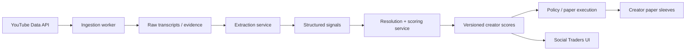

# BITprivat Social Trader Validation Contract

Version 1.0 · June 2026

## Purpose

The Social Traders page must never present creator content-derived proxy returns as validated investment performance. This contract defines the extraction schema, resolution rules, conservative scoring formula, and API fields that drive the UI distinction between `validated` and `proxy` creators.

## Existing Infrastructure To Keep

BITprivat already has the right low-cost foundation:

- FastAPI social-intelligence API on Akash.
- Scheduled worker on the same Akash footprint.
- Neon Postgres storage.
- YouTube Data API ingestion gated by `BSM_YOUTUBE_API_KEY`.
- Cloudflare routing and public fallback snapshots.

The rebuild extends this footprint instead of replacing it.

## Target Services



## 1. Extraction Schema

The extraction service receives transcript text plus the video publish timestamp. One video may produce zero or more signals.

```json
{
  "video_id": "string",
  "channel_id": "string",
  "video_publish_ts": "2026-06-02T14:02:00Z",
  "language": "en",
  "signals": [
    {
      "asset": "BTC",
      "asset_type": "crypto",
      "direction": "long",
      "claim_type": "tradeable",
      "conviction": 0.72,
      "horizon": "swing",
      "horizon_hours": 168,
      "entry": 103800.0,
      "target": 112000.0,
      "invalidation": 99500.0,
      "is_personal_position": true,
      "evidence_quote": "I'm long here with a stop just under 99.5k",
      "evidence_timestamp_sec": 842,
      "extractor_confidence": 0.88
    }
  ]
}
```

### Field Rules

| Field | Rule |
|---|---|
| `direction` | `long`, `short`, or `neutral`. |
| `claim_type` | `tradeable`, `commentary`, or `educational`. Only `tradeable` becomes a prediction. |
| `horizon` | `intraday`, `swing`, or `multiweek`. |
| `horizon_hours` | Exact resolution deadline. Defaults: intraday `24`, swing `168`, multiweek `720`. |
| `conviction` | Creator commitment inferred from transcript, `0..1`. |
| `extractor_confidence` | Model confidence in parse, `0..1`; below `0.6` escalates to a stronger model. |
| `entry`, `target`, `invalidation` | Nullable; missing levels use default bands. |
| `evidence_quote` | Mandatory verbatim evidence. |
| `evidence_timestamp_sec` | Mandatory timestamp in the source video. |

Hard extraction instructions:

- Extract only from the transcript body, never from the title alone.
- When uncertain between `tradeable` and `commentary`, choose `commentary`.
- No signal is accepted without a quote and timestamp.

## 2. Resolution Rules

Resolution converts proxy evidence into validated outcomes.

When a tradeable signal is extracted:

1. Snapshot `price_at_publish` using BITprivat's own market feed at `video_publish_ts`.
2. Keep the prediction open until `video_publish_ts + horizon_hours`.
3. Resolve from post-publication market data only. No look-ahead data, no creator-supplied pricing.

### Default Bands

If target or invalidation is missing:

| Horizon | Default target / invalidation band |
|---|---:|
| intraday | `+/- 2%` |
| swing | `+/- 6%` |
| multiweek | `+/- 12%` |

### Outcomes

For a long signal:

- `win`: target is reached before invalidation within the horizon.
- `loss`: invalidation is reached first, or horizon ends below entry/snapshot.
- `no_result`: price stays between target and invalidation through the horizon.

Short signals mirror the same logic inverted.

`neutral`, `commentary`, and `educational` items are context only and are never resolved as predictions.

`resolved_return` is the signed move from `price_at_publish` to resolution point. Correct shorts on drops are positive.

## 3. Creator Scoring Formula

Scores recompute on a schedule from resolved predictions only.

Raw metrics:

- `hit_rate = wins / resolved_call_count`
- `avg_return = mean(signed resolved_return)`
- `risk_adjusted_return = mean_return / stdev_return`
- `hit_rate_ci = Wilson interval half-width`

Sample and recency weights:

```text
sample_weight = min(1.0, resolved_call_count / 30)
recency_weight = exp(-days_since_last_resolved / 60)
```

Composite:

```text
composite_score =
  100 * sample_weight * recency_weight *
  (0.45 * hit_rate
  + 0.35 * normalize(risk_adjusted_return)
  + 0.20 * normalize(avg_return))
```

`normalize()` squashes values into `0..1` with sensible caps, for example risk-adjusted return capped around `3`.

Critical UI gate:

```text
validation_state = "validated" only when resolved_call_count >= 20
validation_state = "proxy" otherwise
```

Proxy creators must not show green performance numbers.

## 4. Scorecard API Contract

Every creator scorecard should expose these fields:

```json
{
  "creator_id": "wealth-secret",
  "name": "Wealth Secret",
  "validation_state": "proxy",
  "resolved_call_count": 6,
  "composite_score": 14.2,
  "hit_rate": null,
  "hit_rate_ci": null,
  "avg_return": null,
  "risk_adjusted_return": null,
  "proxy_roi": 19.3,
  "score_history": [12.1, 13.0, 14.2],
  "primary_asset": "BTC",
  "risk_tier": "medium",
  "deploy_status": "not_deployed",
  "last_resolved_at": "2026-05-30T00:00:00Z"
}
```

Compatibility note: the current API may still include legacy fields such as `win_rate`, `roi_if_followed`, and `average_roi`. The UI must prefer the validation contract above and treat legacy performance fields as proxy-only unless `validation_state == "validated"`.

## 5. UI Rules

- Show `Validated` stats only when `validation_state == "validated"` and `resolved_call_count >= 20`.
- Render validated hit rate as `62% +/- 8% over 34 calls`.
- Render proxy creators as `Unvalidated - N resolved calls`.
- Proxy ROI may be shown only behind an amber `Proxy` treatment and never as green PnL/performance.
- Default sorting must not rank creators by proxy ROI.
- The Social Traders page must keep the `PAPER` execution boundary visible on every deploy/allocation action.

## 6. Build Order

1. Lock the API contract and UI fallback states.
2. Build resolution and scoring service.
3. Add policy/paper execution rules using validated signals.
4. Add portfolio sleeves and per-creator attribution.
5. Scale ingestion only after scoring honesty is working.

