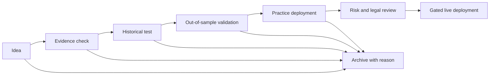
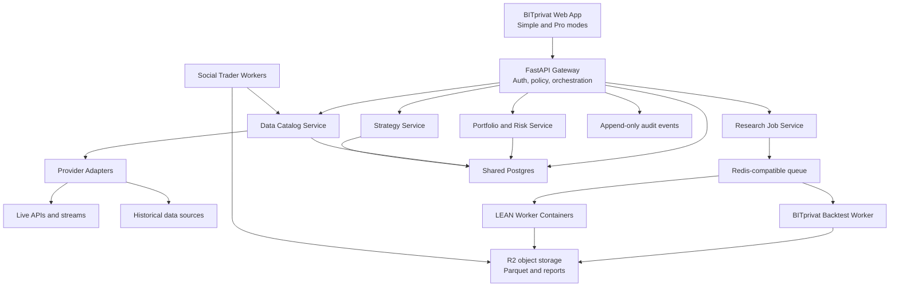

# BITprivat Data and Strategy Platform Plan

Version 1.0 - July 1, 2026  
Status: Proposed for product review before implementation  
Owner: BITprivat product and engineering  
Benchmark: QuantConnect Dataset Market, Algorithm Lab, Research Pipeline, and LEAN

## 1. Executive Decision

BITprivat should pursue capability parity with the useful parts of QuantConnect, not visual or data duplication.

The product should combine:

- a simple, guided interface for people who are not professional traders;
- a trustworthy dataset catalog with explicit source, freshness, coverage, cost, and licensing information;
- plain-language strategy creation with optional expert controls;
- reproducible research, backtests, optimization, paper deployment, and gated live deployment;
- BITprivat's differentiated social-trader, prediction-market, and explainable bot intelligence;
- the open-source LEAN engine as an isolated advanced backtest and execution runtime;
- the current BITprivat engine as the fast path for simple strategies and product iteration.

The default user experience must answer five questions:

1. What do you want to learn or automate?
2. Which markets and information should the system use?
3. What rule should it follow?
4. How much could it gain or lose in realistic historical conditions?
5. Is it safe enough to watch, paper trade, or submit for live approval?

The product must never imply that access to more datasets guarantees better returns.

## 2. What QuantConnect Actually Provides

QuantConnect is a complete quantitative workflow rather than only a dataset website. Its important capabilities are grouped below.

| Capability family | QuantConnect capability | BITprivat target |
| --- | --- | --- |
| Dataset market | Searchable traditional, fundamental, and alternative datasets | Build a provider-neutral Data Library with simple explanations and licensing states |
| Point-in-time data | Uniform timestamps, symbol mapping, corporate actions, and survivorship-bias controls | Add immutable provenance, availability timestamps, symbol mapping, and quality checks |
| Research | Python/C# notebooks and historical data queries | Offer guided research cards first; add expert notebooks later |
| Strategy creation | Code, templates, AI assistants, and project parameters | Plain-language Strategy Builder with an optional generated-code view |
| Backtesting | Event-driven simulation with realistic fees, fills, slippage, margin, and brokerage models | Use the current engine for simple tests and LEAN workers for advanced tests |
| Optimization | Parameter ranges, objectives, constraints, and distributed jobs | Add guarded optimization with train/test separation and overfitting warnings |
| Reports | Equity, drawdown, returns, exposure, crises, capacity, and risk statistics | Produce a plain-English report with an expandable professional metrics view |
| Research pipeline | Idea, research, backtest, paper, live, and archive stages | Implement a user-friendly Strategy Journey with explicit safety gates |
| Paper trading | Live data with simulated orders and fills | Upgrade BITprivat paper mode with reconciliation and realistic venue models |
| Live trading | Brokerage and exchange adapters using the same algorithm model | Keep live execution locked until legal, risk, security, and venue gates pass |
| Project management | Projects, versions, files, collaboration, libraries, and reports | Add strategy versions, ownership, sharing, and organization workspaces later |
| API and CLI | Project, file, backtest, optimization, report, and live deployment APIs | Standardize an internal job API and later expose scoped enterprise access |
| Learning | Tutorials, examples, templates, and strategy library | Add contextual explanations and a guided Learning Center for normal users |

### Dataset families to represent

The BITprivat catalog should support the same broad information model without redistributing QuantConnect-controlled data:

- Price data: crypto spot, crypto perpetuals, equities, ETFs, indices, forex, commodities, futures, options, and prediction markets.
- Market microstructure: trades, quotes, candles, order books, funding, open interest, liquidations, volatility, and Greeks.
- Reference data: symbol history, exchange calendars, contract metadata, tick sizes, corporate actions, and delistings.
- Fundamentals: company financials, valuation factors, earnings, dividends, splits, and ETF constituents.
- Macro: rates, inflation, employment, central-bank series, energy, and economic calendars.
- Alternative data: news, social content, creator evidence, sentiment, insider activity, public-official activity, government contracts, web activity, and on-chain metrics.
- User data: uploaded CSV/Parquet files, private APIs, watchlists, signals, and user-created labels.

## 3. Legal and Commercial Boundary

QuantConnect states that many datasets are licensed for use in its cloud or for internal LEAN use and cannot be freely redistributed. BITprivat must not scrape, mirror, repackage, or resell those datasets.

Approved acquisition patterns:

1. Direct provider contract held by BITprivat with redistribution rights.
2. Public or open data whose terms permit the intended commercial use.
3. User-owned API connection where the user supplies credentials and has the required license.
4. QuantConnect Cloud integration through a user's authorized account, if its API and commercial terms permit the workflow.
5. User-uploaded data with an explicit declaration of rights.

Every dataset record must display:

- provider and source URL;
- data category and supported assets;
- historical coverage and resolution;
- update frequency and measured freshness;
- live, delayed, end-of-day, demo, or unavailable state;
- known quality limitations;
- permitted uses: charting, research, backtest, paper, live, download, or export;
- price and billing owner;
- retention and redistribution restrictions.

No dataset can be activated in a commercial workflow until a `DataLicensePolicy` exists for it.

## 4. Current BITprivat Baseline

This assessment reflects the repository and production posture reviewed on July 1, 2026.

| Area | Status | Reusable now | Missing for target |
| --- | --- | --- | --- |
| FastAPI application | Shipped, monolithic | Auth, APIs, persistence, orchestration, static delivery | Domain boundaries, job isolation, service contracts |
| Public hosting | Shipped | Cloudflare edge and Akash origin | Stronger deployment observability and durable shared storage |
| Production database | Temporary | SQLite supports the current web service | Shared Postgres is required for web and worker consistency |
| Market providers | Partial live | Binance, CoinGecko, and Hyperliquid adapters | Normalized candles, order books, coverage, SLAs, and licensed history |
| Prediction markets | Partial live | Polymarket and Kalshi public intelligence | Historical normalization, outcome settlement, and execution parity |
| Social traders | Partial/demo | YouTube discovery, creator profiles, signal extraction | Durable worker data, validated outcomes, transcript rights, more sources |
| Strategy Lab | Partial | Saved strategies, custom parameters, backtest results, exports | Async jobs, realistic models, comparisons, walk-forward tests, LEAN runtime |
| Paper trading | Partial | Internal ledger, preview, risk checks, order records | Reconciliation, venue models, portfolio accounting, continuous deployments |
| UI | Functional but overloaded | Existing routes and component concepts | Separate pages, simple mode, progressive disclosure, consistent navigation |
| Legal/readiness | Partial | Terms, privacy, risk, and internal planning | Dataset licenses, counsel review, suitability, live permissions, claims policy |

## 5. Product Positioning

### Product promise

> Turn an investment idea into an understandable, evidence-backed simulation without needing to write code.

### Primary user groups

| User | Primary need | Default experience |
| --- | --- | --- |
| Curious beginner | Understand what data and a strategy mean | Guided mode, plain language, examples, strong warnings |
| Retail investor | Test and paper-run a repeatable idea | Guided builder, comparison reports, paper portfolio |
| Creator follower | Evaluate and simulate a creator's public views | Social Trader Bot with evidence and validated outcomes |
| Advanced trader | Control parameters, providers, execution, and code | Pro mode with technical panels and LEAN-backed runs |
| Small research team | Share data, strategies, runs, and approvals | Organization workspace, roles, audit, and usage budgets |

### Two interface levels

`Simple` is the default. `Pro` is an explicit preference.

| Simple mode | Pro mode |
| --- | --- |
| Human descriptions | Full schemas and technical names |
| Five-step strategy wizard | Visual rule builder and code view |
| Three to five key metrics | Full risk and trade statistics |
| Recommended defaults | Editable fill, fee, slippage, margin, and data settings |
| Explanation of each result | Raw logs, orders, events, and downloadable artifacts |
| One clear primary action | Batch actions, comparison, optimization, and API controls |

## 6. Information Architecture

Every primary menu item must be a separate route. The top application bar, language, number formatting, account state, and Simple/Pro mode remain consistent across pages.

| Route | Simple label | User outcome |
| --- | --- | --- |
| `/home` | Home | See portfolio, active bots, important alerts, and next actions |
| `/data` | Explore Data | Find information by question, market, source, or cost |
| `/ideas` | My Ideas | Capture and organize hypotheses before testing |
| `/strategies` | My Strategies | Create, version, compare, and promote strategies |
| `/results` | Test Results | Understand backtests and compare alternatives |
| `/social-traders` | Expert Bots | Explore evidence-trained creator research bots |
| `/paper` | Practice | Run strategies with simulated money and live information |
| `/portfolio` | Portfolio | Understand holdings, risk, P&L, and allocation |
| `/connections` | Connections | Manage data, exchange, wallet, broker, and user-owned APIs |
| `/learn` | Learn | Follow contextual lessons and explainers |
| `/settings` | Settings | Control language, display, privacy, alerts, and security |

Pro-only workspaces can appear inside these routes rather than becoming more top-level navigation.

## 7. Core User Experience

### 7.1 Explore Data

The catalog should organize data by user intent, not vendor jargon.

Primary entry questions:

- What is the market doing?
- What are people saying?
- What are institutions or insiders doing?
- What is happening in the economy?
- What is happening on-chain?
- What events may move prices?
- What data can I use for free?

Each dataset appears as a compact card with:

- plain-language name;
- one-sentence value statement;
- example question it can help answer;
- market and asset coverage;
- history length;
- freshness state;
- cost state;
- trust and quality state;
- `Preview` and `Use in a strategy` actions.

Dataset detail uses five tabs:

1. Overview.
2. Coverage.
3. Sample.
4. Quality and limitations.
5. License and cost.

The preview must show a small chart or table, an explanation of every field, and the actual source timestamp. It must never expose data that the current license does not permit.

### 7.2 Build a Strategy

The Simple wizard uses five screens:

1. Goal: describe the idea in normal language.
2. Market: choose assets or a ready-made basket.
3. Evidence: choose price, social, macro, prediction-market, or creator-bot inputs.
4. Rules and safety: select when to enter, exit, pause, and how much to risk.
5. Test: select period, starting amount, fees, and comparison benchmark.

Example:

> When Bitcoin is above its 50-day average and creator sentiment improves, invest 10% of the practice portfolio. Exit after a 7% loss or 15% gain.

The UI converts this into a versioned `StrategyBlueprint`. Before running, it shows a short machine-readable summary and a plain-language confirmation.

### 7.3 Understand Results

The first screen should not lead with Sharpe, alpha, or beta. It should lead with:

- Final result: what EUR 1,000 would have become.
- Worst period: largest fall from a previous high.
- Consistency: how often the strategy was profitable.
- Comparison: result versus holding the selected benchmark.
- Cost impact: fees and estimated slippage.
- Confidence warning: sample size, missing data, and overfitting risk.

An expandable `Professional details` area contains CAGR, Sharpe, Sortino, volatility, alpha, beta, information ratio, turnover, exposure, capacity estimate, MAE/MFE, VaR, and trade-level logs.

The report must show:

- equity and drawdown curves;
- monthly and yearly returns;
- winning and losing trade distributions;
- asset and signal attribution;
- performance during selected crisis periods;
- in-sample versus out-of-sample results;
- all data providers and dataset versions;
- engine version, strategy version, fee model, and run hash.

### 7.4 Strategy Journey



Each strategy card displays its current stage, owner, last result, warning state, and one next action. Moving to a later stage requires the acceptance gate for that stage.

## 8. Capability Build, Integrate, or Defer Matrix

| Capability | Decision | Reason |
| --- | --- | --- |
| Dataset catalog and metadata | Build | Core BITprivat UX and licensing control |
| Direct provider adapters | Build selectively | Own reliability and commercial permissions |
| QuantConnect dataset mirroring | Do not build | Redistribution and vendor-lock risks |
| User-owned QuantConnect API connector | Investigate, then integrate | Can accelerate licensed research for eligible users |
| Simple BITprivat backtester | Keep and harden | Fast, understandable tests for common strategies |
| LEAN advanced runtime | Integrate as isolated service | Mature Apache-2.0 event-driven engine and broker models |
| Browser IDE | Defer | High complexity and wrong first experience for beginners |
| Jupyter research environment | Phase 6 Pro feature | Valuable for experts, not required for simple product launch |
| Visual/no-code strategy builder | Build | Central differentiation for normal users |
| AI strategy translator | Build after deterministic schema | AI should create a blueprint, not execute arbitrary code |
| Optimization jobs | Build on job system | Required, but must include overfitting controls |
| Paper deployment | Build and reconcile | Core proof step before live execution |
| Brokerage/exchange adapters | Integrate one at a time | Each needs legal, risk, and operational approval |
| Team collaboration | Build after single-user workflow | Commercial value, lower priority than data correctness |
| Strategy marketplace | Defer | Requires track-record verification, moderation, and legal review |

## 9. Target Technical Architecture



### Architecture rules

- The web request path never runs a long backtest.
- Every test, optimization, and report is a resumable job.
- Web and workers use the same Postgres database.
- Large time series and result payloads live in object storage as versioned Parquet/JSON artifacts.
- Postgres stores catalogs, permissions, job state, summaries, and pointers to artifacts.
- Redis-compatible infrastructure handles short-lived queues, locks, rate limits, and progress events, not durable truth.
- Provider responses are normalized into internal schemas and retain raw provenance.
- LEAN runs in isolated containers with CPU, memory, time, network, and data-access limits.
- No generated user strategy receives unrestricted shell, filesystem, or network access.

### Recommended implementation path

Use a hybrid engine contract:

```text
StrategyBlueprint
  -> validate schema
  -> resolve datasets and licenses
  -> choose engine: bitprivat-simple or lean
  -> create immutable run manifest
  -> execute isolated job
  -> normalize engine output
  -> generate simple and professional reports
```

The same strategy version may have multiple runs, but a completed run is immutable.

## 10. Core Data Models

| Model | Essential fields |
| --- | --- |
| `DatasetDefinition` | id, name, category, provider, description, schema, assets, resolutions |
| `DatasetVersion` | dataset_id, version, available_at, coverage, checksum, quality status |
| `DataLicensePolicy` | allowed uses, jurisdictions, retention, export, redistribution, billing owner |
| `ProviderConnection` | owner, provider, auth type, scopes, status, last check, secret reference |
| `DataPointProvenance` | source, observed_at, available_at, ingested_at, normalized_at, raw artifact |
| `ResearchIdea` | owner, hypothesis, expected mechanism, evidence, stage, decision history |
| `StrategyBlueprint` | universe, signals, rules, sizing, risk, execution assumptions, parameters |
| `StrategyVersion` | strategy_id, version, blueprint hash, engine target, created_by, created_at |
| `BacktestJob` | strategy_version, datasets, date range, status, progress, worker, costs, result |
| `OptimizationJob` | parameters, ranges, objective, constraints, train/test split, child runs |
| `RunManifest` | engine, image/version, datasets, fees, slippage, benchmark, random seed, hash |
| `PerformanceReport` | summary, metrics, curves, trades, warnings, attribution, artifact links |
| `PaperDeployment` | strategy_version, capital, limits, venue model, state, reconciliation status |
| `LiveDeployment` | approvals, venue, credentials reference, limits, kill switch, state |
| `AuditEvent` | actor, action, object, before/after hashes, timestamp, correlation id |

Point-in-time correctness requires separate `observed_at` and `available_at` timestamps. A backtest may only consume information whose `available_at` time is not later than the simulated decision time.

## 11. API Contracts to Standardize

### Data Library

```text
GET    /api/v1/datasets
GET    /api/v1/datasets/{dataset_id}
GET    /api/v1/datasets/{dataset_id}/coverage
GET    /api/v1/datasets/{dataset_id}/sample
GET    /api/v1/datasets/{dataset_id}/quality
GET    /api/v1/datasets/{dataset_id}/license
POST   /api/v1/datasets/{dataset_id}/activate
POST   /api/v1/datasets/import
```

### Ideas and strategies

```text
GET    /api/v1/ideas
POST   /api/v1/ideas
PATCH  /api/v1/ideas/{idea_id}
POST   /api/v1/ideas/{idea_id}/promote
GET    /api/v1/strategies
POST   /api/v1/strategies
GET    /api/v1/strategies/{strategy_id}
POST   /api/v1/strategies/{strategy_id}/versions
POST   /api/v1/strategies/{strategy_id}/validate
```

### Jobs and reports

```text
POST   /api/v1/backtests
GET    /api/v1/backtests/{job_id}
POST   /api/v1/backtests/{job_id}/cancel
POST   /api/v1/optimizations
GET    /api/v1/optimizations/{job_id}
GET    /api/v1/reports/{report_id}
GET    /api/v1/reports/{report_id}/artifacts
POST   /api/v1/reports/compare
```

### Deployment and controls

```text
POST   /api/v1/deployments/paper
GET    /api/v1/deployments
GET    /api/v1/deployments/{deployment_id}
POST   /api/v1/deployments/{deployment_id}/pause
POST   /api/v1/deployments/{deployment_id}/stop
POST   /api/v1/deployments/{deployment_id}/liquidate
POST   /api/v1/deployments/{deployment_id}/promote
GET    /api/v1/connections
POST   /api/v1/connections
POST   /api/v1/risk/check
GET    /api/v1/audit/events
```

All responses carrying market or research values must include `data_mode`, `source`, `as_of`, `freshness_seconds`, and `license_scope`.

## 12. Backtesting and Research Standards

Every backtest must model:

- data availability time;
- exchange calendar and timezone;
- missing and stale data;
- fees and rebates;
- spread and configurable slippage;
- order type and fill behavior;
- leverage, margin, funding, and liquidation where applicable;
- corporate actions and symbol changes where applicable;
- delisted assets and survivorship bias;
- position sizing and capital constraints;
- benchmark and cash return assumptions.

Required anti-overfitting controls:

- a locked out-of-sample period;
- minimum sample-size warnings;
- parameter-count and search-space warnings;
- walk-forward analysis for promoted strategies;
- benchmark comparison;
- sensitivity chart around selected parameters;
- multiple-testing disclosure for optimization;
- no promotion based only on in-sample return.

## 13. Visual and Interaction Design

The interface should feel calm and approachable, not like a professional terminal forced onto a beginner.

### Design principles

1. One decision per screen.
2. Normal words first; technical terms appear through tooltips and Pro mode.
3. Show risk beside return, never in a separate hidden panel.
4. Show data origin and freshness wherever a result is shown.
5. Use green and red only for financial direction, not decoration.
6. Use progressive disclosure instead of dense dashboards.
7. Keep persistent navigation and separate routes.
8. Never show a disabled feature as if it works; explain the missing dependency and next step.

### Page shell

- Slim persistent application bar.
- Simple route navigation with meaningful icons and text.
- Global search across datasets, assets, creator bots, strategies, and help.
- English default with Romanian support.
- Consistent EUR/USD and locale-aware number formatting.
- Light and dark themes with WCAG 2.1 AA contrast.
- Context panel or drawer for details; do not jump the user down a long page.

### Empty, loading, and failure states

Every feature must define:

- first-use explanation;
- useful empty state and sample action;
- skeleton loading state;
- queued and progress state;
- stale or delayed data warning;
- permission or license block;
- provider failure with retry guidance;
- result with partial data;
- cancellation and recovery state.

## 14. Delivery Roadmap

The estimates assume one lead engineer plus targeted design, data, legal, and QA support. They are sequencing estimates, not commercial promises.

| Phase | Duration | Deliverable | Acceptance gate |
| --- | ---: | --- | --- |
| 0. Product contract | 1 week | Approved plan, terminology, Simple/Pro boundaries, route map | Stakeholder approval; no unresolved licensing assumption |
| 1. Foundation | 2-3 weeks | Shared Postgres, job table, queue, R2 artifacts, provider metadata | Web and worker share durable state; jobs survive restart |
| 2. New app shell | 2-3 weeks | Separate routes, responsive navigation, localization, simple status system | Playwright passes desktop/mobile EN/RO; no anchor-based primary nav |
| 3. Data Library MVP | 3-4 weeks | Catalog, filters, detail, samples, provenance, license states | At least five real provider families; freshness and terms visible |
| 4. Guided Strategy Builder | 3-4 weeks | Five-step wizard, blueprint schema, validation, versioning | Beginner completes a strategy without code; deterministic output |
| 5. Async BITprivat backtests | 2-3 weeks | Job workers, progress, reproducible manifests, simple reports | Ten-year supported daily test runs outside web process and is reproducible |
| 6. LEAN integration | 4-6 weeks | Isolated LEAN worker, normalized inputs/results, engine selector | Reference strategies match expected LEAN results within defined tolerance |
| 7. Reports and comparison | 2-3 weeks | Plain-language report, Pro metrics, PDF/CSV, compare view | Metrics verified against fixtures; every chart has provenance |
| 8. Optimization and validation | 3-4 weeks | Parameter jobs, constraints, OOS, walk-forward, sensitivity | Promotion blocked when validation requirements fail |
| 9. Paper deployment | 3-5 weeks | Continuous strategy process, simulated fills, reconciliation, alerts | 30-day soak test; restart recovery and kill switch verified |
| 10. Pro research and teams | 4-6 weeks | Notebooks or code workspace, organizations, roles, budgets | Strong tenant isolation and job quotas |
| 11. Gated live execution | Separate program | One approved venue, risk controls, consent, monitoring, incident playbook | Counsel, security, risk, and operational signoff |

### Recommended first commercial slice

The first useful release should include Phases 0-5 and only these data families:

- crypto spot/perpetual price and funding data;
- Polymarket and Kalshi market intelligence;
- macro data from approved public sources;
- YouTube creator evidence with rights-safe metadata and validated signal outcomes;
- user-uploaded CSV data.

This creates a distinctive product without paying for broad institutional equity/options coverage too early.

## 15. Infrastructure and Cost Plan

### Initial production topology

| Component | Recommendation | Cost control |
| --- | --- | --- |
| Web/API | Keep current Akash service initially | Fixed small instance; no heavy jobs |
| Worker queue | Managed Redis-compatible service or dedicated small instance | Queue depth and retention limits |
| Database | Shared managed Postgres | Query limits, connection pooling, egress monitoring |
| Artifacts | Cloudflare R2 | Lifecycle rules and compression |
| Simple workers | Akash CPU deployments | Scale to zero or scheduled capacity where possible |
| LEAN workers | Separate 4-8 vCPU, 8-16 GB containers | Per-job CPU/time/data budgets |
| Observability | Structured logs, error tracking, job metrics | Retention tiers and sampled traces |

The dominant long-term cost is likely market-data licensing, not basic compute. Every provider integration needs a unit-economics sheet covering subscription cost, redistribution rights, users covered, expected request volume, storage, egress, and gross margin.

### Job budget controls

- maximum history and resolution by subscription tier;
- estimated run cost shown before launch;
- concurrent-job limit per user and organization;
- daily CPU and data-download budget;
- deduplication by immutable run hash;
- cached data and result reuse where licenses permit;
- administrator stop control and global compute circuit breaker.

## 16. Security, Safety, and Compliance Gates

Before public paper deployment:

- shared production database and reliable audit trail;
- MFA for sensitive account changes;
- scoped, encrypted provider credentials;
- isolated strategy execution;
- upload scanning and strict file limits;
- provider rate limits and cost budgets;
- explicit paper and delayed-data labels;
- delete/export privacy workflows.

Before any live deployment:

- legal opinion for the target jurisdictions and product behavior;
- KYC/appropriateness decision and implementation where required;
- venue-specific terms and user consent;
- no custody of user private keys or funds;
- per-user notional, leverage, allocation, and daily-loss limits;
- global and per-deployment kill switches;
- idempotent order submission and duplicate prevention;
- reconciliation, alerting, and incident response;
- append-only audit evidence from signal through fill;
- private beta with capped capital and named operators.

## 17. Testing and Acceptance Program

| Layer | Required verification |
| --- | --- |
| Dataset metadata | Schema, coverage, freshness, license, source, and point-in-time fixtures |
| Data quality | Missing bars, duplicates, outliers, timezone, symbol mapping, and stale feeds |
| Strategy schema | Invalid combinations rejected with human-readable messages |
| Backtest engine | Golden reference strategies and deterministic reruns |
| LEAN adapter | Manifest conversion and normalized result parity |
| Reports | Metric calculations, chart datasets, and plain-language interpretation |
| Optimization | Constraints, cancellation, budget limits, OOS isolation, and sensitivity |
| Paper runtime | Fill model, restart recovery, reconciliation, limits, and kill switch |
| UX | Playwright Simple/Pro, EN/RO, mobile, keyboard, and accessibility tests |
| Security | Secret scanning, tenant isolation, authorization, upload abuse, and worker sandbox |
| Production | Cloudflare, Akash, database, queue, artifact store, and provider smoke tests |

## 18. Success Metrics

Product:

- at least 70% of new users complete their first test without opening Pro mode;
- median time from sign-up to first result under 10 minutes;
- at least 50% of completed tests are understood correctly in a short comprehension check;
- fewer than 5% of support requests ask whether demo, delayed, paper, or live data is real;
- at least 25% of successful testers start a seven-day paper deployment.

Engineering:

- 99% of queued jobs reach a terminal state;
- identical run manifests produce identical summary results within the defined numerical tolerance;
- 100% of displayed results include provider, freshness, and data mode;
- no long-running job executes in the API process;
- zero cross-user data or credential access in security tests.

Commercial:

- positive gross margin per active paid user after data and compute costs;
- provider cost can be attributed to user, organization, and product feature;
- premium data cannot be accessed outside its license scope;
- live execution remains unavailable until all gates are independently approved.

## 19. Decisions Required Before Implementation

Recommended defaults are recorded so implementation can begin without redesigning the plan.

| Decision | Recommended default |
| --- | --- |
| Initial asset focus | Crypto, prediction markets, macro, social evidence |
| Default user mode | Simple |
| Advanced engine | Self-hosted LEAN workers, introduced after async job foundation |
| QuantConnect relationship | Optional user-owned API connector; no data mirroring |
| Historical storage | Parquet in R2 plus metadata in Postgres |
| Queue | Redis-compatible queue with Postgres as durable job truth |
| First optimization | Maximum two parameters in Simple mode; Pro mode can request more with warnings |
| First paper venue | Internal realistic simulator, followed by one testnet adapter |
| Live execution | Out of scope until separate approval program passes |

## 20. First Implementation Sprint After Approval

No implementation should begin until this plan is accepted.

The first sprint should produce:

1. `DatasetDefinition`, `DataLicensePolicy`, `StrategyBlueprint`, `RunManifest`, and `BacktestJob` schemas.
2. Shared Postgres restoration or replacement so API and worker use the same durable database.
3. R2 artifact storage and a small Redis-compatible queue.
4. A job runner that executes the existing BITprivat backtest asynchronously.
5. `/data` and `/strategies/new` route skeletons using the permanent application shell.
6. Three catalog adapters: Binance/Hyperliquid market data, FRED-style macro data, and BITprivat social evidence.
7. End-to-end test: select data, create a blueprint, queue a test, monitor progress, and open an understandable result.

Sprint acceptance:

- no backtest executes in the HTTP request process;
- all artifacts include a run hash and provider provenance;
- the same completed result is visible after worker or web restart;
- every data card states live/delayed/demo mode and license scope;
- a first-time user can complete the flow without knowing what Python, CAGR, or Sharpe means.

## 21. Official Research Sources

- QuantConnect Dataset Market: https://www.quantconnect.com/datasets/
- QuantConnect dataset licensing: https://www.quantconnect.com/docs/v2/cloud-platform/datasets/licensing
- QuantConnect dataset overview: https://www.quantconnect.com/docs/v2/cloud-platform/datasets/
- QuantConnect Research Pipeline: https://www.quantconnect.com/docs/v2/cloud-platform/research-pipeline
- QuantConnect Research Environment: https://www.quantconnect.com/docs/v2/cloud-platform/research
- QuantConnect backtesting: https://www.quantconnect.com/docs/v2/cloud-platform/backtesting
- QuantConnect backtest reports: https://www.quantconnect.com/docs/v2/cloud-platform/backtesting/report
- QuantConnect optimization: https://www.quantconnect.com/docs/v2/cloud-platform/optimization/getting-started
- QuantConnect brokerage integrations: https://www.quantconnect.com/docs/v2/cloud-platform/live-trading/brokerages
- QuantConnect REST API: https://www.quantconnect.com/docs/v2/cloud-platform/api-reference/
- LEAN engine documentation: https://www.quantconnect.com/docs/v2/lean-engine/getting-started
- LEAN official repository and Apache-2.0 license: https://github.com/QuantConnect/Lean

## 22. Change Log

| Date | Change |
| --- | --- |
| 2026-07-01 | Initial QuantConnect capability audit, retail UX plan, architecture, roadmap, and acceptance program created. |
